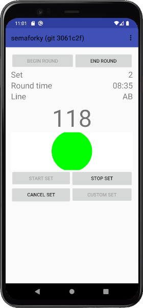
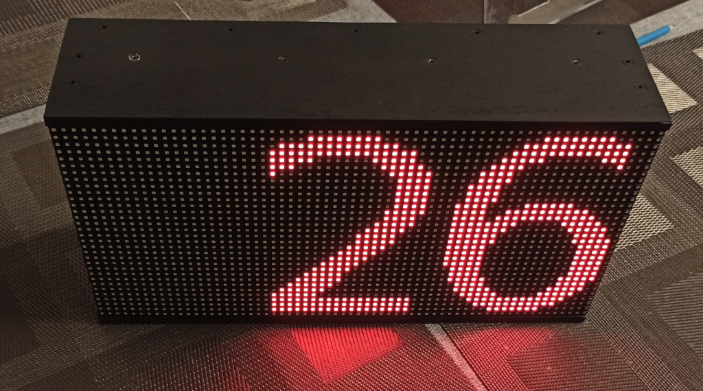

# semaforky
Android/Arduino-based DIY system for remote controlled signaling for sport events

**NEW!: Next-gen version is based on web app hosted by the device on its own wifi network. See [web_app](web_app).**

Semaforky is client-server software for Android/Web browser and several Arduino-based controllers (clients) of various signaling devices:
- Semaphore lights (red, yellow, green)
- Segment clock display
- Siren/acoustic device

This platform was originally designed for archery competitions according to World Archery rules (see [rules](https://www.worldarchery.sport/rulebook/search/clock)). The solution should replace outdated cable-based predecessor.

## Original motivation

Server app             |  Client hardware
:-:|:-:
  |  

## Original goals
- Most of existing devices should be preserved, only extended by remote transmitter and power source.
- Simple construction blueprints of hardware should be also provided (TBD).
- Simple [application](android_app) for Android available for most existing devices should be created to replace Windows-based custom software.

## Second generation goals
- Provide new original hardware, battery powered (via of-the-shelf power-bank), mobile, simple.
- See [blueprints](hardware).

## Third generation goals
- Replace Android App by device hosted [web-app](web_app), runs on anything with a web-browser (laptop, Android device, iPhone).

## Additional features
- Training mode: various countdown and signaling scenarios (e.g. mini games) for training coordination and timing a good form in sport activity.
