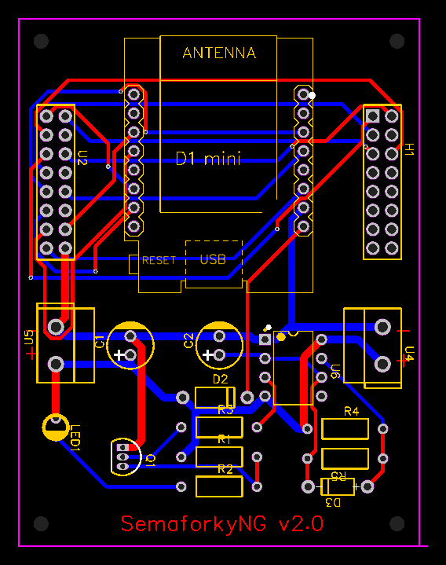

# Custom PCB design in gerber files

* Version 2
  * Voltage protection
  * Pulse generator to keep powerbank running (inspired by  [How to stop a power bank from turning off](https://technoreview85.com/how-to-stop-a-power-bank-from-turning-off/))
* Examine with gerbb utility.
* Edit using [EasyEDA](https://easyeda.com/) online editor.
* Order with [PCBWay](https://www.pcbway.com/) service.

## List of components

|mark          |component              |link|
|--------------|-----------------------|----|
|U5, U4        |KF301-5.0-2P           |[link](https://www.aliexpress.com/item/4000290521933.html)|
|U2, H1            |2.54 Pin Header Connector||
|C1            |220 uF                 ||
|Q1            |2N2222                 ||
|LED1          |                       ||
|C2            |10 uF                  ||
|D2            |1N5817-T               ||
|R3            |1k Ohm                 ||
|R1            |33 Ohm                 ||
|R2            |220 Ohm                ||
|U6            |IC 555                 ||
|R4            |270k Ohm               ||
|R5            |1M Ohm                 ||
|U1            |WeMos D1 Mini Pro V3.0 |[link](https://www.aliexpress.com/item/1005004344044423.html)|