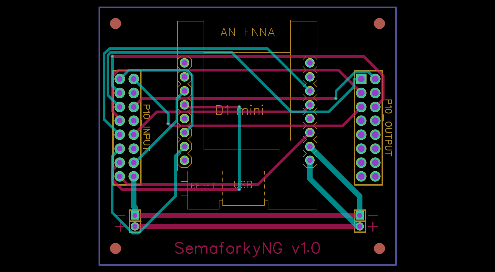

# Custom PCB design in gerber files

* Examine with gerbb utility.
* Edit using [EasyEDA](https://easyeda.com/) online editor (Import *.EasyEDA.json files).
* Order with [PCBWay](https://www.pcbway.com/) service (Zip before upload 'zip PCB.zip *').

