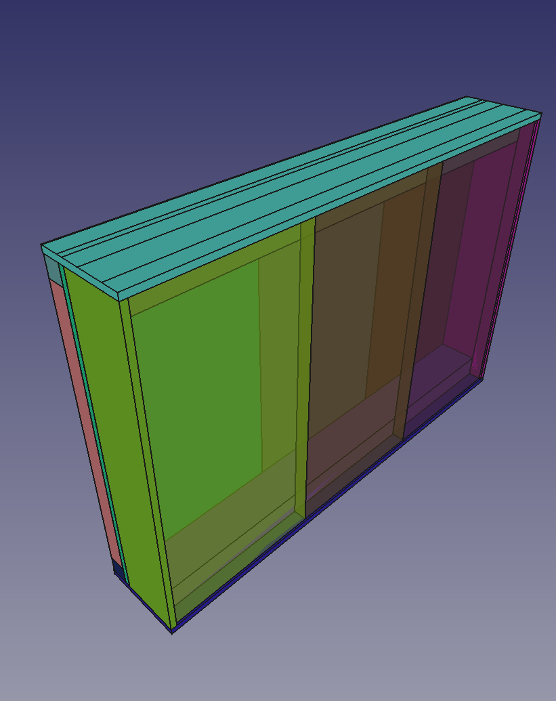
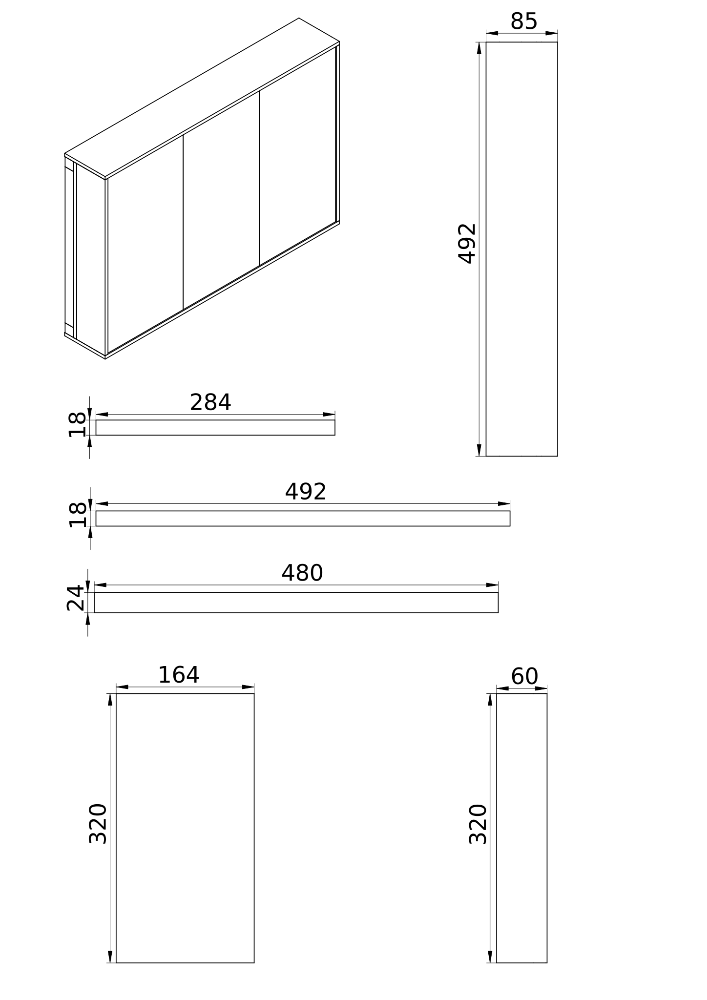

# Simple plywood enclosure

* Version 1
* Sliding back
* Material
  * 6mm plywood
    * 2 x 492mm x 85mm
    * 2 x 320mm x 60mm
    * 3 x 320mm x 164mm
  * 44mm x 24mm timber
    * 2 x 480mm
  * 18mm x 18mm timber
    * 2 x 492mm
    * 4 x 284mm
* Glue wooden parts together or use 3mm x 20mm flat head wood screws.
* Panel is mounted with 4mm x 40mm metric screws through 44mm x 24mm pillars (they must be sank into the wood ~10mm).

## Plan

## Components

