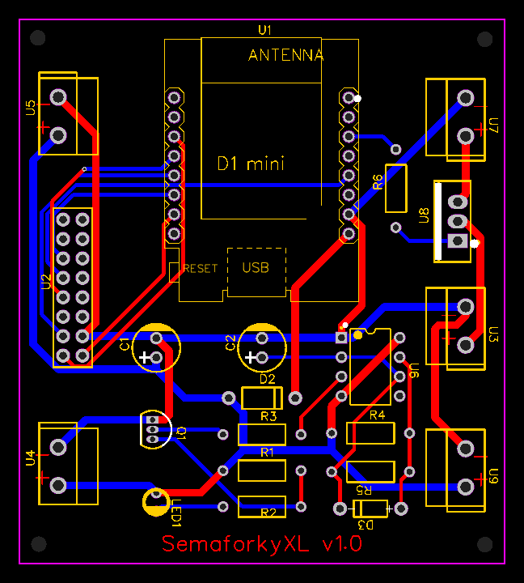

# Custom PCB design in gerber files

* Version 1
  * Voltage protection
  * Pulse generator to keep powerbank running (inspired by  [How to stop a power bank from turning off](https://technoreview85.com/how-to-stop-a-power-bank-from-turning-off/))
* Examine with gerbb utility.
* Edit using [EasyEDA](https://easyeda.com/) online editor.
* Order with [PCBWay](https://www.pcbway.com/) service.

