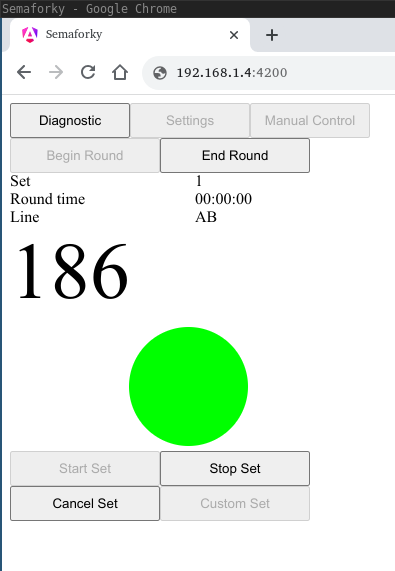
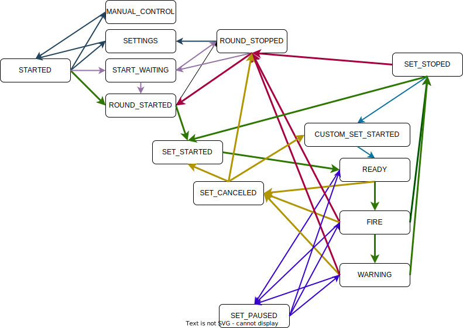

# semaforky webui
Android/Arduino-based hardware controlled via SPA (single page application) web app from any web browser (smartphone, tablet, laptop, PC, Mac, Windows, Linux, ...).

## Motivation

Any Web Browser          |  Hardware running REST/WEB server
:-:|:-:
  |  

## Live demo

See [Live demo]{http://vajicek.github.io/semaforky}.

## Prerequisites

* Arduino 1.8.19
* ESP 8266 board support for Arduino >=1.6.x, set "http://arduino.esp8266.com/stable/package_esp8266com_index.json" in File > Preferences > Additional Board Manger URLs
* [Support for SPIFFS](https://www.instructables.com/Using-ESP8266-SPIFFS/), [plugin v0.5](https://github.com/esp8266/arduino-esp8266fs-plugin/releases/download/0.5.0/ESP8266FS-0.5.0.zip)
* Arduino Libraries (Tools > Manage Libraries...)
    * [ESPAsyncTCP](https://github.com/me-no-dev/ESPAsyncTCP)
    * [ESPAsyncWebServer](https://github.com/me-no-dev/ESPAsyncWebServer)
    * [ArduinoJson](https://github.com/bblanchon/ArduinoJson)
    * DMD2
    * Adafruit GFX Library
    * Fork of [PxMatrix](https://github.com/vajicek/PxMatrix.git) (new scan pattern added)

## Use devcontainer

Build dev container.
```bash
make build_devcontainer
```

Run dev container.
```bash
make devcontainer
```

### Web application
Build **web app**.
```bash
make setup_ng && make build_webapp
```

### Device application
Install dependencies for **device application**.
```bash
make install_common && make install_deps
```

Build and install **device application**, e.g. for p5 device (connected to /dev/ttyUSB0).
```bash
make install_p5
```

Build filesystem for **web app** server and flash it to a device (connected to /dev/ttyUSB0).
```bash
make filesystem.bin && make flash-fs
```

## Semaforky application state diagram



## List of features

* Operations divided into rounds (e.g. training + two halves, FITA 900 - 60m/50m/40m) and rounds into sets (e.g. 10 or 12 sets).
* Scan - gather all devices on given network (specified by Network option). Display number of clients and capabilities (semaphore, siren, line indicator, clock) provided.
* Configurable number of lines - 1 or 2
* Configurable lines rotations - SIMPLE (round 1: AB CD, AB CD, ..; round 2: CD AB, CD AB, ..), ALTERNATING (AB CD, CD, AB, AB, ..)
* Configurable set time, waiting time and warning time.
* Delayed start - set time of start and it will automatically start the first set while showing countdown to start.
* Configurable brightness of all devices.
* Optional sound coming from application. Usable in combination with bluetooth speaker.
* Store configuration in cookies.
* Store state in cookies - should survive page refresh.
* Set cancel (It is like set stop but without incrementing set counter).
* Set pause and resume.
* Manual control for testing purposes (audio, semaphore, clock).